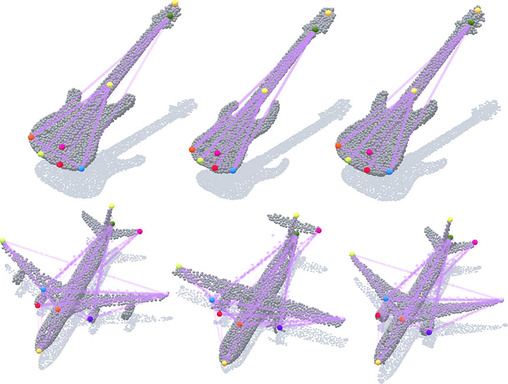

# Skeleton Merger
Skeleton Merger, an Unsupervised Aligned Keypoint Detector.
The paper is available at [https://arxiv.org/abs/2103.10814](https://arxiv.org/abs/2103.10814).

**Update Aug. 6th:** The point cloud visualizer is now released! See [https://github.com/eliphatfs/PointCloudVisualizer](https://github.com/eliphatfs/PointCloudVisualizer).

## A map of the repository
+ The `merger/pointnetpp` folder contains the [Pytorch Implementation of PointNet and PointNet++](https://github.com/yanx27/Pointnet_Pointnet2_pytorch) repository with some minor changes. It is adapted to make compatible relative imports.
+ The `merger/composed_chamfer.py` file contains an efficient implementation of proposed Composite Chamfer Distance (CCD).
+ The `merger/data_flower.py` file is for data loading and preprocessing.
+ The `merger/merger_net.py` file contains the `Skeleton Merger` implementation.
+ The root folder contains several scripts for training and testing.

## Usage of script files
Usage of the script files, together with a brief description of data format, are available through the `-h` command line option.

## Dataset
The ShapeNetCore.v2 dataset used in the paper is available from the [Point Cloud Datasets](https://github.com/AnTao97/PointCloudDatasets) repository.
